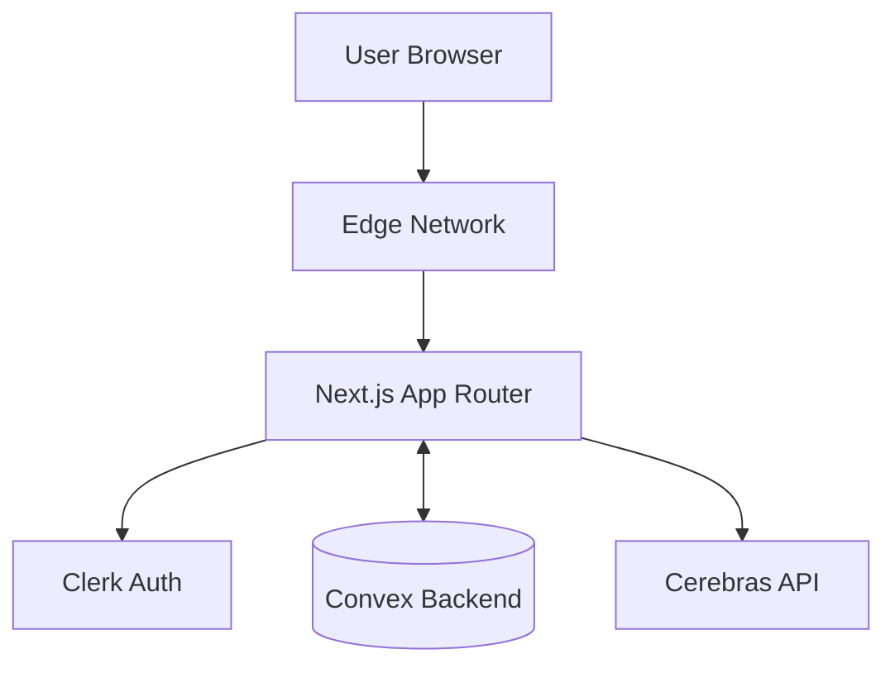

# Architecture Design Document

## 1. High-Level Architecture

The application is a Next.js application hosted on Vercel, using **Convex** as the backend platform (database + serverless functions + real-time sync).

> **Note:** The platform is built with Convex for simplicity, but the course material teaches the traditional T3 stack (Drizzle ORM + PostgreSQL + tRPC).

## 2. Core Components

### 2.1 Frontend

- **Framework:** Next.js 15 (App Router).
- **Styling:** Tailwind CSS + shadcn/ui.
- **Component Library:** Atomic design pattern.
- **State:** `nuqs` for URL-driven state (filters, tabs), Convex React hooks for server state.

### 2.2 Backend Layer

- **Platform:** Convex (database, serverless functions, real-time subscriptions).
- **API:** Convex queries and mutations (type-safe, auto-generated).
- **Demo API:** Standard Next.js Route Handlers (`/api/...`) for the "Learn Backend" track demonstrations.
- **Database:** Convex Database (document-based, real-time).

### 2.3 Internationalization (i18n)

- **Routing:** Path-based (`/en/dashboard`, `/ar/dashboard`).
- **Library:** `next-intl`.
- **Direction:** CSS logical properties (`margin-inline-start`) and Tailwind's `rtl:` modifier.

### 2.4 Code Execution Engine

- **Client-Side:** Sandpack (by CodeSandbox) for React/Node experiments running in browser.
- **Fallback:** Read-only Monaco editor if execution is too heavy.

### 2.5 AI Service

- **Provider:** Cerebras (fast inference).
- **Implementation:** Vercel AI SDK (`ai` package) for streaming responses.
